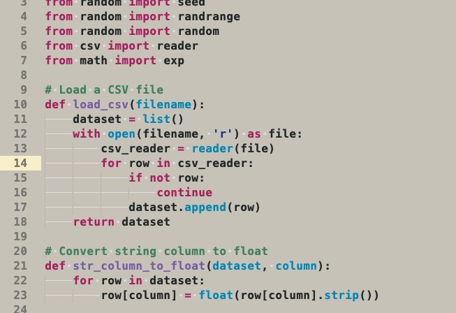

# SublimeText-LightGrayTheme

A Sublime Text theme with warm light gray background easy on the eyes. Extended with support for Markdown.

## Install

Download it to your Packages/User folder then add it to your `Package Control.sublime-settings` file.

`{
	"color_scheme": "Packages/User/LightGrayExtended.tmTheme"
}`

